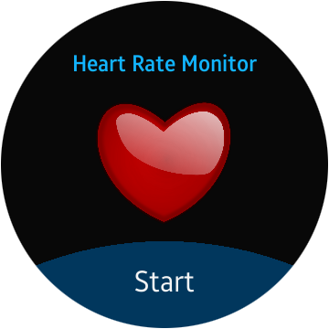
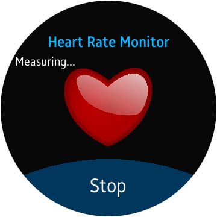
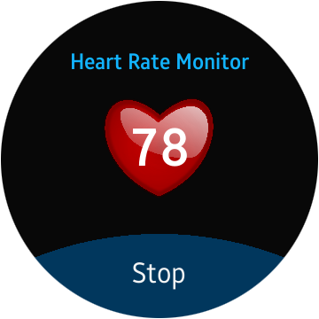

# HeartRateSampleWebApp
Heart Rate Monitor
The Heart Rate Monitor sample application demonstrates how you can measure the user's current heart rate.

The following figure illustrates the main screens of the Heart Rate Monitor.
 
 

 

The application opens with the main screen that shows a heart icon and start button. On tapping over start button, the heat rate sensor located on the back of Gear S2 start measuring your heart rate. 

 
 

 

After the measurement is complete, the current heart rate is displayed.
  
 

 

The heart image in the background is animated with the measured heart rate. The application continues to measure the heart rate and update the heart rate value and keeps animating. 
If the application cannot measure the heart rate, an information screen is shown after 10 seconds.
 

